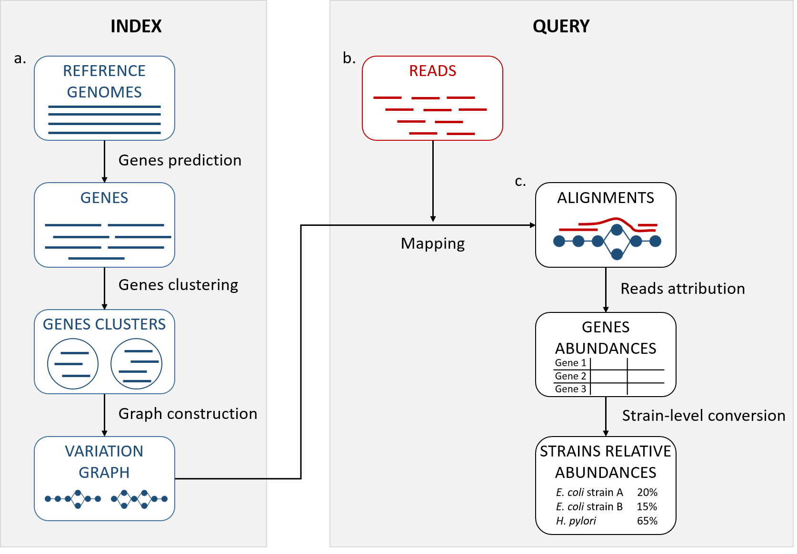

# StrainFLAIR

**StrainFLAIR** (STRAIN-level proFiLing using vArIation gRaph) is a tool for strain identification and quantification that uses variation graph representation of genes sequences. The input is a collection of complete genomes, draft genomes or metagenome-assembled genomes from which genes will be predicted. StrainFLAIR is sub-divided into two main parts: first, an indexing step that stores clusters of reference genes into variation graphs, and then, a query step using mapping of metagenomic reads to infere strain-level abundances in the queried sample.




StrainFLAIR is composed of several modules. Each module of the pipeline is described below.

## Dependencies (all installed by the Install procedure)
* [prodigal](https://github.com/hyattpd/Prodigal)
* [cdhit](https://github.com/weizhongli/cdhit)
* [minimap2](https://github.com/lh3/minimap2)
* [seqwish](https://github.com/ekg/seqwish)
* [vg](https://github.com/vgteam/vg)
* [pandas](https://pandas.pydata.org/)

## Install 

```bash
 git clone https://github.com/kevsilva/StrainFLAIR
 cd StrainFLAIR
 conda env create -p Strain --file env.yml
 conda activate ./Strain
 pip install strainflair
```


## StrainFLAIR pipeline

### Usage

`StrainFLAIR.sh` is a pipeline combining the indexation and query steps. Mapping is to be done separately.

TODO

### Full indexation and query example

TODO

## 

## StrainFLAIR modules

#### Module `genes_prediction` : prediction of protein-coding genes from each input sequence

From the input reference sequences, protein-coding genes are predicted using **Prodigal**. To reduce mapping bias at the extremities, predicted genes can be extended on both ends if the reference sequence it originates from allows it.

Example: `genes_prediction -s file_of_fasta_files.txt -o my_output_directory_name -l 75`

#### Module `cd-hit-est`: clustering of the predicted genes

Genes are clustered using **CD-HIT**. Genes are then grouped into gene families and the resulting clusters are composed of similar genes according to the user-defined thresholds and parameters.

Example: `cd-hit-est -i my_genes_not_extended.fasta -o clusters_files_name -c 0.95 -aS 0.90 -g 1 -d 0 -M 0 -T 0 -G 0`

#### Module `graphs_construction` and `concat_graphs`: building a variation graph representing the gene clusters

Each gene cluster (gene family) is converted into a variation graph. All variation graphs are then concatenated into a single one and indexed.

Example: 
```
graphs_construction -s my_genes_extended.fasta -c cluster_file.clstr -o my_output_directory_name
concat_graphs -i my_input_directory_name -s 1000
vg view final_graph.vg > final_graph.gfa
vg prune final_graph.vg | vg index -g final_graph.gcsa -
vg index -x final_graph.xg final_graph.vg
vg snarls final_graph.vg > final_graph.snarls
```

#### Mapping reads onto a variation graph

Mapping of reads onto a variation graph is done using `vg mpmap` from **vg toolkit**. The output needs to be into the JSON format.

Example: 
```
vg mpmap -x final_graph.xg -g final_graph.gcsa -s final_graph.snarls -f my_reads.fastq.gz -t 24 -M 10 -m -L 0 > mapping_output.gamp 
vg view -j -K mapping_output.gamp  > mapping_output.json
```

#### Module `json2csv`: Gene-level abundances

Mapping results are processed according to our developed algorithm to attribute abundances to the reference genes.

Example: `json2csv -g final_graph.gfa -m mapping_output.json -p dict_clusters.pickle -o output_file_name`

#### Module `compute_strains_abundance`: Strain-level abundances

Gene-level abundances are converted into strain-level abundances. Strain abundance is set to zero if not metting the threshold of proportion of detected genes.

Example: `compute_strains_abundance -i gene_level_table.csv -o my_output_directory -t proportion_detected_genes_threshold`

## Contact

Kévin Da Silva: kevin.da-silva@inria.fr

Pierre Peterlongo: pierre.peterlongo@inria.fr


